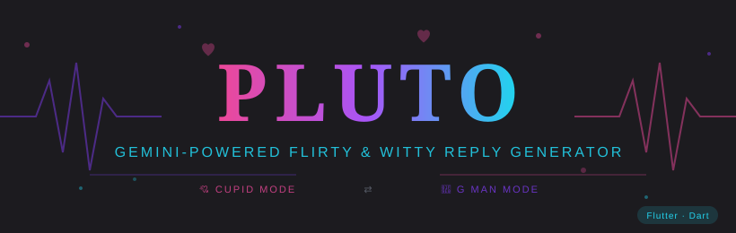
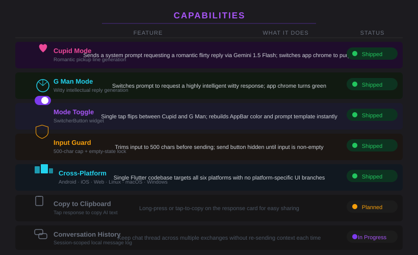
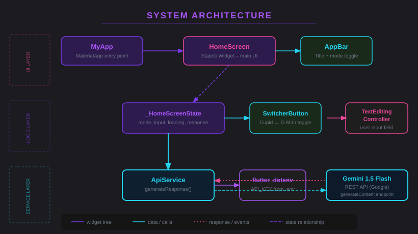
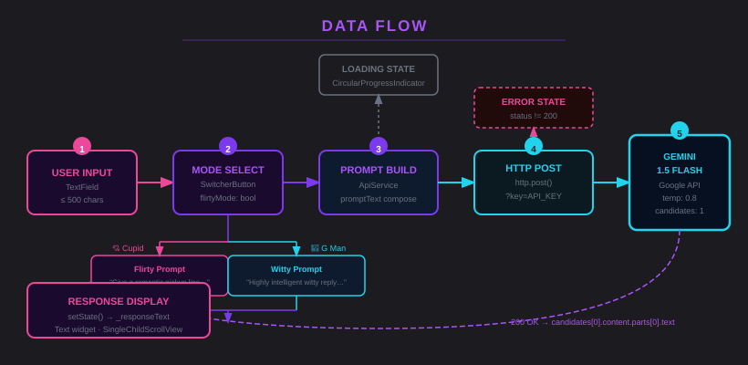
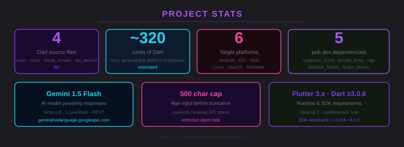

<p align="center">
  
</p>

**Because sometimes you need a pickup line, and sometimes you need to sound like the smartest person in the room. Pluto handles both.**

<p align="center">
  <a href="#features">Features</a> •
  <a href="#installation">Installation</a> •
  <a href="#usage">Usage</a> •
  <a href="#architecture">Architecture</a> •
  <a href="#roadmap">Roadmap</a> •
  <a href="#license">License</a>
</p>

---

*Pluto started as an answer to a simple question: what if you could ask an AI to be charming on your behalf? Not a full chatbot — just a one-shot reply generator that commits to a bit. Cupid mode writes romantic pickup lines. G Man mode writes the kind of response that makes people think you've read too many books. You pick the persona; Gemini does the heavy lifting.*

Pluto is a Flutter application that wraps the Google Gemini 1.5 Flash REST API with two distinct personality modes. Type anything, flip the toggle, hit send, and get back either a flirty one-liner or a wit-forward reply — instantly, with no conversation context to manage. It's a deliberate single-screen design: no chat history, no settings maze, no onboarding. The interesting part is that both modes are driven by the same model with radically different system prompts, and the app chrome (AppBar color) visually commits to whichever persona is active.

---

<p align="center">
  
  
  
  
  
</p>

---

## System Overview

Pluto is a single-screen Flutter app. The widget tree is intentionally shallow: `MyApp` → `HomeScreen` (StatefulWidget) → `_HomeScreenState`. State management is entirely local to `_HomeScreenState` — no `Provider`, no `Riverpod`, no `Bloc`. The API layer lives in `ApiService`, a static class that composes prompts, calls Gemini via `http.post`, and parses the JSON response. The `.env` file, loaded at startup via `flutter_dotenv`, is the only config surface.

```
flirty/
├── lib/
│   ├── main.dart          # App entry point; loads .env, mounts MyApp
│   ├── const.dart         # Shared text styles (txtstyle)
│   ├── screens/
│   │   └── home_screen.dart  # Single screen: toggle + input + response
│   └── services/
│       └── api_service.dart  # Gemini REST client + prompt construction
├── .env                   # API_KEY (gitignored)
├── .env.example           # Template for .env
├── pubspec.yaml           # Dependencies and Flutter config
├── android/               # Android platform project
├── ios/                   # iOS platform project
├── web/                   # Web platform project
├── linux/                 # Linux platform project
├── macos/                 # macOS platform project
├── windows/               # Windows platform project
└── test/                  # Flutter test directory
```

See the architecture diagram below for how components connect.

---

## Features

| Feature | What it actually does |
|---|---|
| 💘 **Cupid Mode** | Sends a Gemini prompt requesting a romantic pickup line for your input text; AppBar turns purple |
| 🧠 **G Man Mode** | Sends a Gemini prompt requesting a witty, high-intellect reply; AppBar turns green |
| ⚡ **Mode Toggle** | A `SwitcherButton` widget that instantly flips the active mode and rebuilds the AppBar color in one `setState` call |
| 🔄 **Loading Indicator** | Shows a `CircularProgressIndicator` while the API call is in flight; send button disappears so you can't double-send |
| 🛡️ **Input Guard** | Silently truncates input to 500 characters before sending; the send button is hidden until the text field has content |
| 📱 **Cross-Platform** | One codebase, six deployment targets: Android, iOS, Web, Linux, macOS, Windows — no platform-specific UI branches |
| 🌑 **Material 3 Dark Theme** | `ThemeData.dark(useMaterial3: true)` — the UI defaults to dark mode and does not offer a toggle (this is not a bug) |
| 🔑 **dotenv Config** | `API_KEY` is read from a `.env` file at startup; missing key surfaces as a readable error in the response card, not a crash |

---

## Capability Visualization

<p align="center">
  
</p>

---

## Architecture

<p align="center">
  
</p>

Pluto runs entirely on the Flutter single-thread model — the main isolate handles UI and the `async`/`await` Dart concurrency model handles the API call without blocking. There are no background isolates, no platform channels, and no native plugins. `_HomeScreenState` owns all mutable state: the toggle boolean (`_switchValue`), the text controller, the loading flag, and the current response string. When `_sendRequest()` fires, it flips `_isLoading` to true, awaits `ApiService.generateResponse()`, then calls `setState` with the result (or the error message).

The decision to use a static `ApiService` rather than a service locator or DI container was deliberate: the app has one API and one screen. Adding a layer of indirection would be architecture for its own sake. The API key is fetched from `flutter_dotenv` on every call rather than cached in a field — this makes the key reloadable without a hot restart in development, and it's a negligible performance cost for an app with no SLA.

---

## Data Flow

<p align="center">
  
</p>

Primary path from keypress to rendered response:

```
User types → TextField (TextEditingController)
  → send button appears (setState: _isInputEmpty = false)
  → tap send → _sendRequest()
    → setState(_isLoading = true) → CircularProgressIndicator shown
    → input truncated to 500 chars
    → mode check: flirtyMode=true → "Give a single flirty reply…" prompt
                  flirtyMode=false → "Give a reply that sounds like a highly intelligent…" prompt
    → http.post(gemini endpoint, body=JSON, headers=Content-Type)
      → 200 OK → parse candidates[0].content.parts[0].text
        → setState(_responseText = result, _isLoading = false)
      → non-200 → setState(_responseText = "Error: …", _isLoading = false)
```

---

## Installation

### Prerequisites

1. **Flutter SDK** (≥ 3.x) — install from [flutter.dev](https://flutter.dev/docs/get-started/install). Flutter ships with Dart; you don't install them separately.
2. **A Gemini API key** — get one free at [aistudio.google.com](https://aistudio.google.com/). The free tier is sufficient for personal use.

### Steps

1. **Clone the repo**

   ```bash
   git clone https://github.com/Kaelith69/flirty.git
   cd flirty
   ```

2. **Create your `.env` file** from the provided template

   ```bash
   cp .env.example .env
   ```

   Then open `.env` and replace `YOUR_GEMINI_API_KEY_HERE` with your actual key:

   ```
   API_KEY=AIza...
   ```

   > The `.env` file is gitignored. Never commit a real API key.

3. **Fetch Flutter dependencies**

   ```bash
   flutter pub get
   ```

   This downloads `http` (HTTP client), `google_fonts` (Playfair Display + Roboto), `switcher_button` (mode toggle widget), `flutter_dotenv` (reads `.env`), and `cupertino_icons`.

4. **Run the app**

   ```bash
   # Pick your target:
   flutter run                   # connected Android/iOS device or emulator
   flutter run -d chrome         # web
   flutter run -d linux          # Linux desktop
   flutter run -d macos          # macOS desktop
   flutter run -d windows        # Windows desktop
   ```

### Platform-specific notes

| Platform | Requirement |
|---|---|
| Android | Android SDK, emulator or physical device |
| iOS | Xcode 14+ on macOS; physical device or Simulator |
| Web | Chrome (or any modern browser with `flutter run -d web-server`) |
| Linux | `clang`, `cmake`, `ninja-build`, `pkg-config`, `libgtk-3-dev` |
| macOS | Xcode 14+ |
| Windows | Visual Studio 2022 with "Desktop development with C++" workload |

---

## Usage

1. Launch the app. You'll see the **Pluto** header and the **G MAN ↔ CUPID** toggle.

2. **Pick your mode:**
   - Slide the toggle to **CUPID** (purple AppBar) for a flirty pickup line.
   - Leave it at **G MAN** (green AppBar) for a witty intellectual reply.

3. **Type your message** in the text field at the bottom. The send button appears once you've typed something.

4. Tap the **↑ arrow button**. A spinner appears while Gemini processes.

5. Your AI-crafted reply appears in the response card. The text field clears automatically.

6. Repeat as needed. Each request is independent — there's no conversation context carried forward.

> **Pro tip:** Cupid mode works best with something vague or abstract ("I like rainy days"). The more mundane your input, the funnier the pickup line Gemini invents to justify it.

---

## Project Structure

```
flirty/
├── 📄 main.dart            # Boots the app; loads .env; mounts MaterialApp
├── 📄 const.dart           # txtstyle() — the Roboto/24px/w400 text style
├── 📦 screens/
│   └── 📄 home_screen.dart # Everything the user sees; all state lives here
├── 📦 services/
│   └── 📄 api_service.dart # Static Gemini client; prompt builder; response parser
├── 🔒 .env                 # Your API key — never commit this
├── 📋 .env.example         # Safe template to commit
├── 📋 pubspec.yaml         # Flutter/Dart deps; SDK constraints; asset registration
├── 📋 pubspec.lock         # Locked dep tree — commit this
├── 📋 CHANGELOG.md         # Release notes
├── 📋 CONTRIBUTING.md      # Contribution guide
├── 📋 SECURITY.md          # Security disclosure policy
├── 📁 android/             # Android platform project (generated)
├── 📁 ios/                 # iOS platform project (generated)
├── 📁 web/                 # Web platform project (generated)
├── 📁 linux/               # Linux platform project (generated)
├── 📁 macos/               # macOS platform project (generated)
├── 📁 windows/             # Windows platform project (generated)
└── 📁 test/                # flutter_test directory
```

---

## Performance Stats

<p align="center">
  
</p>

---

## Privacy

Pluto sends the text you type directly to the Google Gemini API. Google's standard data handling policies apply to anything sent to that API — review them at [ai.google.dev/terms](https://ai.google.dev/terms).

**Pluto itself:**
- Does not collect, log, or store any user input or AI responses.
- Does not use analytics, crash reporting, or any third-party telemetry SDK.
- Does not make any network requests except the single `POST` to `generativelanguage.googleapis.com`.
- Does not store your API key anywhere except the local `.env` file you control.

If you're not comfortable with your text being sent to Google's API, don't use the app. There's no offline mode.

---

## Roadmap

### Core UX
- [x] Cupid mode (flirty pickup line)
- [x] G Man mode (witty reply)
- [x] Mode toggle with AppBar color feedback
- [x] Loading state with spinner
- [x] Error surfacing in response card
- [ ] Copy-to-clipboard on response card
- [ ] Regenerate button (get a fresh reply for the same input)

### Conversation
- [ ] Session-scoped conversation history
- [ ] Clear history button

### Personas
- [ ] More AI personas beyond Cupid and G Man
- [ ] Tone/temperature slider exposed in UI

### Platform
- [ ] App icon (all platforms)
- [ ] Standalone build instructions (APK, IPA, MSIX, AppImage)
- [ ] CI/CD pipeline

---

## Packaging

To build a standalone binary for distribution:

```bash
# Android APK
flutter build apk --release

# iOS IPA (requires Xcode and Apple Developer account)
flutter build ipa

# Web (outputs to build/web/)
flutter build web

# macOS app bundle
flutter build macos --release

# Windows MSIX
flutter build windows --release

# Linux
flutter build linux --release
```

Release artifacts land in `build/<platform>/`. The `.env` file is bundled as a Flutter asset — make sure your API key is present before building a release, or the app will show an error on first use.

---

## Contributing

PRs are welcome. See [CONTRIBUTING.md](CONTRIBUTING.md) for the full guide.

---

## Security

To report a vulnerability, follow the process in [SECURITY.md](SECURITY.md).

---

## License

MIT — see [LICENSE](LICENSE). Built by [@Kaelith69](https://github.com/Kaelith69).
